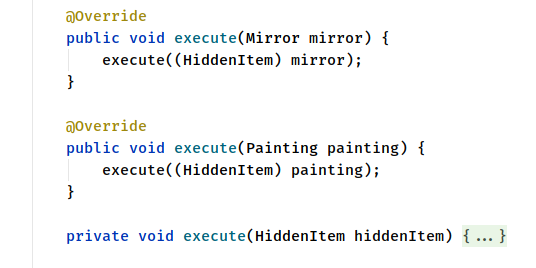
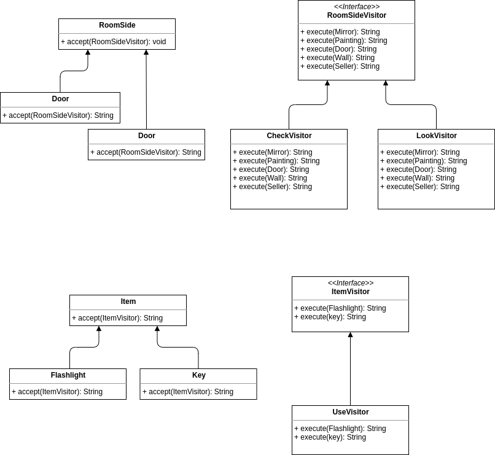
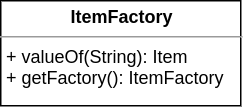
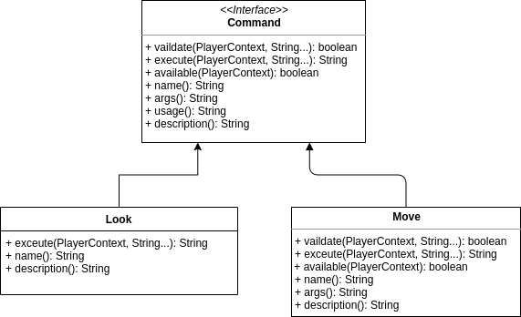
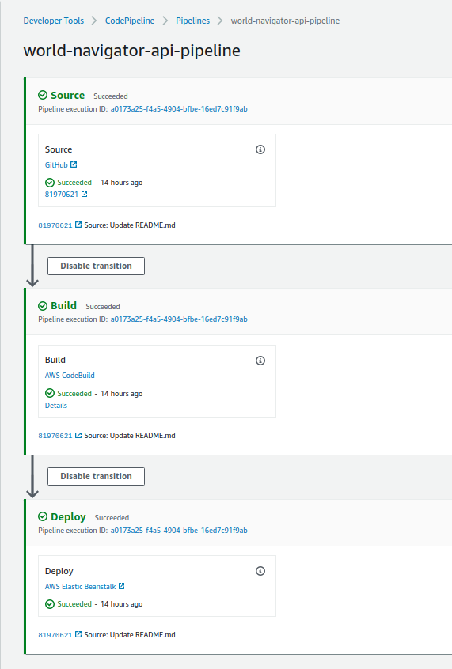

# Effective Java

## Item 5: Prefer dependency injection to hardwiring resources

In the maze classes like `Room`, `RoomSide`, ...etc all take their 
dependencies from the constructor this allows `Jackson` library 
to deserialize json to construct a maze from it.

In web package and game commands also take their 
dependencies from the constructor this allows spring to provide
their dependencies.

Using this technique makes it easy to change the 
dependencies of a class without affecting or changing the class. 

## Item 10: Obey The General Contract When Overriding Equals

In `Key` item implementation I needed to override the equals 
method as not all keys are the same like the `Flashlight` item
every key is identified by it's color.

The implementation is auto generated by intellij so no need to make tests for it.

The signature have the `Override` annotation to make sure we 
are implementing the right method. 
```
@Override
public boolean equals(Object o) {
    if (this == o) return true;
    if (o == null || getClass() != o.getClass()) return false;
    Key key = (Key) o;
    return color.equals(key.color);
}
```

## Item 11: Always Override Hashcode When You Override Equals

I also override the hashCode method for the `Key` class as the book says, 
because not doing so violates the `hashCode` contract.

```
@Override
public int hashCode() {
    return Objects.hash(color);
}
```


## Item 12: Always override toString

I used the `toString` method in the `Item` subclasses to make 
the items have a string representation and this representation 
can be used to reconstruct the item using the `ItemFactory` that takes a string
gives back an appropriate item instance and following the book's advice a documented for each `Item` subclass the format 
which this class is using.

For example `Key` class `toString`:

```
/**
 * The string format that this method returns is
 * "color key" where color is substituted by the key's color.
 *
 * @return string representation of the key.
 */
@Override
public String toString() {
    return color + " key";
}
```

and I made it required to implement a `toString` for 
each new subclass of the `Item` class by making it abstract.

 
I also override it in the `RoomSide` subclasses 
to return the type as I think it's good for using it to output messages 
to the player in the commands.

## Item 16: In public classes, use accessor methods, not public fields

all classes in the project uses this item.

## Item 17: Minimize Mutability

Some immutable classes in the project are `Key`, `Wall` and `Seller`.

Any class that are not immutable I minimized the mutability as much as I can
for example in `Room` class the sides map can't be accessed outside the class
but made `getSide` method to access each side. 

In the `Seller` class the prices map is unmodifiable, so it's fine to
return access to it by the `getPrices` method.

## Item 19: Design And Document For Inheritance Or Else Prohibit It

The classes that are designed for inheritance in the project are
`Item` and `RoomSide` classes.

In the `Item` class it's made clear that the `toString` method 
must be overridden and what to be expected from it.

```
/**
 * This method made is abstract to make all items
 * have a description and every item must have a format
 * for the description that is enough to reconstruct the item from it
 *
 * @return The description of the item
 */
@Override
public abstract String toString();
```

Any class that is not design for inheritance I made it `final`

for example `Key`, `Flashlight`, `Door` and `Chest` to name a few. 
and in the future I want a class to be inherited I can remove the final
keyword and make the nessesary changes.

This better than allowing it in the first place as it can be abused.

## Item 21: Design interfaces for posterity

The `Command` interface has new default methods `validate` and 
`available` the two methods return true as this implementation 
is reasonable as in the previous command subclasses in the previous
version of the project the responsibility of these methods where in
the execute method so adding these new methods won't break older commands.

So with the new methods older command classes are available and their
arguments are valid by default and new command can take advantage of
these methods to separate the responsibilty of the execute method.  

## Item 22: Use interfaces only to define types

Used whenever possible in the project.

## Item 23: Prefer class hierarchies to tagged classes

Class hierarchies I made in the project are `RoomSide` and `Item` classes.

This way the code is clean, short and can be easily extensible. 

## Item 25: Limit source files to a single top-level class

This item is followed by all files in the project.

## Item 26: Don’t use raw types

Raw types are never used in the project.

Because generics provide a good protection at compile time, this way you can prevent bugs
from happening or find them earlier.

## Item 34: Use enums instead of int constants

I used `Direction` enum to define directions in the maze.

making directions enum is more powerful, you can assign 
different behavior with each enum constant.

In the `Direction` enum I assigned three behaviors `left`, `right` and `reverse`.

Other enums created are `Hand`, `FightStatus` and `PlayerMode`.

This also makes the code cleaner and more robust.

## Item 37: Use EnumMap instead of ordinal indexing  

Used in the `Room` implementation to store the room sides.


## Item 40: Consistently use the Override annotation

using this can prevent hidden bugs like when overriding `equals` method.

## Item 42: Prefer lambdas to anonymous classes

Used whenever possible in the project especially in streams.

## Item 49: Check parameters for validity

from the `Lock` class

```
@JsonCreator
public Lock(
        @JsonProperty("key") Key key,
        @JsonProperty("open") boolean open,
        @JsonProperty("locked") boolean locked
) {
    this.key = key;

    if(open && locked)
        throw new IllegalArgumentException("The lock can't be open and locked at the same time.");

    this.open = open;
    this.locked = locked;
}
```

`Objects.requireNonNull` is used when ever appropriate in the project.

## Item 53: Use varargs judiciously

I used `varargs` in `Command` interface and according to the book 
it's safe as the signature didn't declare a generic type. 

## Item 55: Return optionals judiciously

In the `HiddenItem` interface the `getItem` method returns 
an `Optional<Item>` because it's Ok to not have a hidden item and
making the method returns `Optional` enforces that.

It's used in the `Lockable` interface because it's OK to not have a 
lock.

## Item 57: Minimize the scope of local variables

I used this item as much as possible.

## Item 64: Refer to objects by their interfaces

Used whenever applicable.

For example I used `Command` interface to refer to commands in 
the invoker execute method.

## Item 72: Favor the use of standard exceptions

Some of the exceptions used are `IlligalArgumentException` and `IlligalStateException`.

## Item 85: Prefer alternatives to Java serialization

I used `Jackson` library to deserialize the maze from json format.

# Clean Code

## Use Intention-Revealing Names

For example the `Lockable` interface the name implies that the 
object can be open or closed, and it's applied to the door and the chest objects

```
public interface Lockable {
    Lock getLock();
}
```

and For `HiddenItem` interface

```
public interface HiddenItem {

    Optional<Item> getItem();

    void setCollected(boolean collected);

    boolean isCollected();
}

```

## Use Solution Domain Names

`ItemFactory` makes it clear that the class implements an Abstract Factory.

`RoomSideVisitor` makes it clear that the interface represents a visitor pattern.

## Functions should be small

following the book's advice all functions that I have written
are no more than 20 lines give or take.

This way the methods are small, clear and readable.

## Don’t Repeat Yourself

Instead of repeating the code in the `CheckVisitor` for the `Door`
and the `Chest` I made a method for handling both using the fact that
the implementation depends on the `Lockable` interface, and made the 
same for the `Painting` and the `Mirror` class as the implementation 
depands on the `HiddenItem` interface.

## Comments

I didn't use any comments in the code and when I have the urge to write 
a comment I set back and think if a could make the code more readable.

But as the book said I made good comments like **Javadocs in Public APIs**.

## Formatting

### Vertical Openness Between Concepts

Making a blank line between concepts like between methods or import statements
and class declaration.

And this advice is also enforced by the Style Guide.

### Dependent Functions

Dependent Functions should be close together.



### Vertical Ordering

When implementing an interface the methods of it should be together.

# Design Patterns

## Visitor Pattern

This pattern is used in the `check`, `look` and `use` commands as these
commands deals with each type differently.



## Abstract Factory Pattern

This pattern is used in `ItemFactory` class.

The class is implemented using a factory method `valueOf`
which takes a `String` that represents the item description following
the item description format described in its `toString()` method 
and returns the matching `Item` object.



## Singleton Pattern

This pattern is used in the `ItemFactory`.

And used in the commands classes, but these are made singleton using spring core IoC mechanism.  

as we need one object from these classes and global access to them.

## Command Pattern

Used to implement the various commands of the game



## Facade Pattern

The `Invoker` class is sort of a facade where it provides an interface to interact with
all the game commands.

# SOLID Principles

## Single-Responsibility Principle

For example the `Player` class has a responsibility to store the state of the player and
the `Fight` class has the responsibility to represent a fight.

## Open-Closed Principle

`Command` hierarchy follows this principle that you can add commands without
affecting other commands.

`RoomSide` hierarchy you can also add subclasses without affecting others, but because
I used the Visitor pattern each visitor must add another method to handle the new subclass
this is reasonably fine because when you add new subclasses you need to handle then anyway

Because the player is expecting something when they run the command that uses a visitor like
`CheckCommand`. 

## Liskov substitution principle

All subclasses in the project can be substitutable.

For example in the `Command` interface all commands are referenced and used in the `Invoker `
using the interface.

## Interface segregation principle

Based on this principle I made `Lockable` and `HiddenItem` interfaces
because not all `RoomSide` subclasses are lockable like the `Chest`
and `Door` classes, and not all subclasses have hidden items like 
`Painting` and `Mirror`.

## Dependency Inversion principle

I used spring IoC mechanism to instantiate objects and provide them 
with their required dependencies, for example ``

In the `Invoker` class it depends on the `Command` and
`Map` interfaces, and these are abstractions.

And when ever I need a list or a map I define 
them by their interfaces `List` and `Map`.

# Concurrency Issues

I used synchronization in the `Move` command as the player must remove themselves from the 
current room and add themselves to the destination room so these two rooms must be synced
so no player will interfere with the transition of the player.

I also synced the `FightResolver` so that if the two player played at the same time this will
make an issue.

# Data Structures

In `Invoker` class I used a Map to store the commands, where the command
name is the key and the command itself is the value, I used the Map
because it's fast and I need to query the commands by the name as 
the name is unique.

In the `Room` class is used an `EnumMap` as it's more efficient than
`HashMap` for enums.

In `Maze` class I used a `List` to store the rooms, because a maze
is a list of rooms and the each room is identified by it's index 
in the list.

In `Player` class I used a `Map` to store the items, I used a map instead
of a `List` is because items have a description and when the game user
query them they use the item description, so it's faster to store them
in a map instead of a list and because not all items are immutable, 
but their description is.

In the `Seller` class a `Map` is used to map an item description
to a price, and when the player buys or sells an item the description
is used to create the item using the `ItemFactory`.

In the `Chest` class I used a `List` of items, I didn't use the item description
because the items in the chest are going to be collected once so
it is safe to store the actual item.

# Style Guide

In this project I used [Google style guide](https://google.github.io/styleguide/javaguide.html)

# DevOps Implementation

## CI/CD Pipeline

I used `AWS CodePipeline` service to implement a CI/CD pipeline.



The pipeline consists of three steps

### Pull Source Code From GitHub

When the `master` branch changes Github will notify AWS Pipeline using web hooks
to start the pipeline.

### Building

The building process uses `AWS CodeBuild` service to build the project.

the service uses `buildspec.yml` file to specify how the project will get build.

After the build the artifacts are stored in an S3 bucket to be deployed.

### Deploying

For deployment, I used `AWS Elastic Beanstalk` to manage and run the application.

After the build process `AWS Pipeline` service pulls the artifacts from the S3 bucket and 
provided it to `AWS Elastic Beanstalk` to run the application.